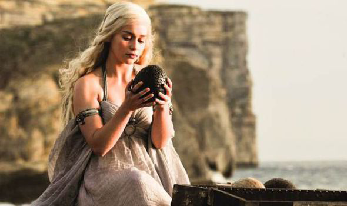

# Day 44 – CSS Revision & Motivation Meme Project 🎨  

This day was focused on revising important CSS styling concepts and applying them in a fun project.  

## 📘 Topics Revised
- Colors & background colors  
- Font size, font family, and font weight  
- Margin, border, and padding  

## 📂 Project Structure
DAY44/
│

├── CSS-1/

│ ├── font-size.html

│ └── index.html

│
├── CSS-2/

│ └── index.html

│
├── CSS-3/

│ └── index.html

│
├── Motivation-Meme-Project/

│ ├── assets/images/daenerys.jpg

│ ├── index.html

│ └── solution.css

## 🖼️ Motivation Meme Project
A small meme page using **HTML + CSS**, where Daenerys holds a dragon egg, captioned humorously as finding the *perfect avocado in the supermarket*.  

### Demo Screenshot:

## 🚀 How to Run
1. Clone the repository  
2. Navigate to the `Motivation-Meme-Project` folder  
3. Open `index.html` in your browser  

## 🔑 Takeaway
Even the simplest CSS properties like **margins, borders, and colors** play a vital role in delivering clean and engaging user interfaces.